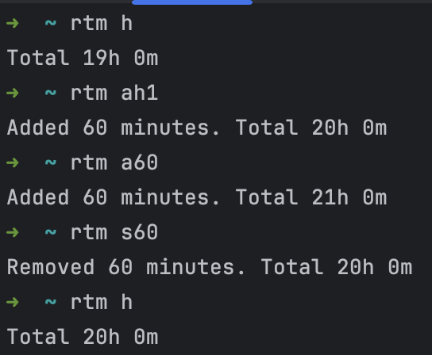

# RTM CLI
This project is a command-line interface (CLI) tool designed for tracking time.
A hidden folder named ```.rtm``` is created in your home directory to store the time.txt file that tracks the current time spent.

## Setup
```cargo install --path```

## Usage
- Add 1 hour: ```rtm ah1```
- Add 60 minutes: ```rtm a60```
- Remove time: ```rtm s60```
- Get time: ```rtm h```

